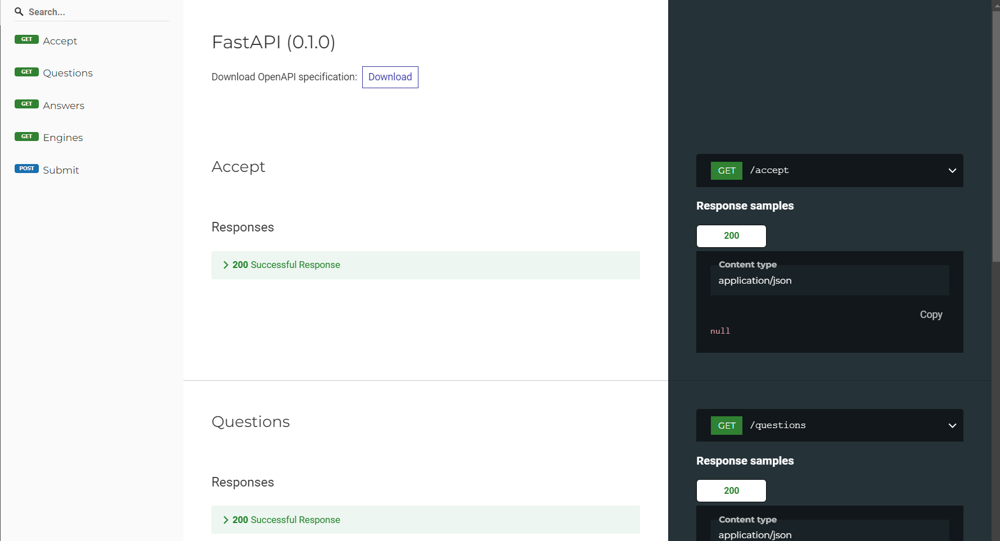

# CopyLeft AI API
This repository contains infrastructure/services in support of the CopyLeft AI Annotator app located here: https://github.com/arthurwolf/annotator.

The services include:
- API Gateway (Traefik Reverse Proxy)
- CLAIF API (FastAPI with Swagger and Redoc Docs)
- Adminer (Database Administration Utility)
- Keycloak (Identity and Access Management)

# Installation
## Using Docker and Docker-Compose
- build the images and start the containers with `docker-compose up -d`
- tear them down with `docker-compose down`
- stop them with `docker-compose stop`
- start them with `docker-compose start`
## Using Kubernetes
Coming Soon

# Accessing the Applications
## API Gateway (Traefik)
Traefik is an open-source, modern reverse proxy and load balancer designed to handle dynamic microservices environments. It integrates with various orchestration and container platforms like Docker, Kubernetes, Mesos, and Consul to automatically route and manage traffic for web applications.

- visit the dashboard at http://localhost:8081
- make requests to the API at http://localhost:8080 (TODO)

Key Features of Traefik:
- Reverse Proxy:
  - Traefik acts as a reverse proxy, forwarding client requests to one or more backend servers, typically used to serve web applications.
- Dynamic Configuration:
  - Traefik dynamically discovers and configures services from container orchestrators like Docker, Kubernetes, or cloud platforms without requiring manual configuration of routes. It automatically adjusts when new services are added or removed.
- Load Balancing:
  - Traefik can distribute incoming traffic across multiple backend services, providing load balancing to improve availability and performance.
- Auto SSL with Let's Encrypt:
  - Traefik can automatically generate and manage SSL certificates using Let's Encrypt, making it easy to enable HTTPS for your services.
- Path-Based and Host-Based Routing:
  - Traefik supports both path-based routing (e.g., /api) and host-based routing (e.g., api.example.com), allowing you to route traffic to different backend services based on the URL or domain name.
- Middleware:
  - Traefik has built-in support for middleware that allows you to modify or enhance requests and responses. For example, you can use rate-limiting, retry mechanisms, authentication, or headers modification.
- Health Checks:
  - Traefik can monitor the health of backend services and route traffic only to healthy instances, improving reliability and fault tolerance.
- Dashboard:
  - Traefik includes a real-time dashboard that provides visibility into active services, routing rules, and load balancer statistics.
- HTTP/2 and gRPC Support:
  - It supports modern protocols like HTTP/2 and gRPC, enabling improved performance and efficiency for certain types of web applications.
- Extensive Provider Support:
  - Traefik works with multiple backends like Docker, Kubernetes, Amazon ECS, Consul, Rancher, and more. It can automatically detect changes in the infrastructure and reconfigure itself.
- Authentication and Authorization:
  - Traefik supports authentication middlewares (like basic auth, OAuth2, etc.) to secure routes.

## CLAIF API (FastAPI)
### Swagger Docs (Swagger UI)
- visit http://localhost:8082/docs

### Redoc Docs
- visit http://localhost:8082/redoc

## Adminer
A lightweight browser-based database administration utility. This has been added only as a convenience to expedite onboarding.
- visit http://localhost:8083

## Keycloak
Keycloak is an identity and access management (IAM) solution. It provides authentication and authorization services for applications, enabling features like Single Sign-On (SSO), user federation, and identity brokering.
- visit the admin console at http://localhost:8085

Key Features of Keycloak:
- Single Sign-On (SSO):
  - Keycloak allows users to log in once and gain access to multiple applications without needing to log in again for each app.
- Identity Brokering and Social Login:
  - Keycloak can act as an intermediary between users and external identity providers (e.g., Google, Facebook, GitHub) to enable social logins.
- User Federation:
  - You can integrate Keycloak with existing user directories such as LDAP or Active Directory, allowing you to manage users from a central system.
- Centralized User Management:
  - Keycloak provides a central place to manage users, roles, and permissions. Users can be created, modified, and deleted through the admin console.
- Role-Based Access Control (RBAC):
  - Keycloak supports role-based access control, allowing administrators to define roles and permissions for users and groups within applications.
- OAuth 2.0, OpenID Connect, and SAML:
  - It supports industry-standard protocols like OAuth 2.0, OpenID Connect, and SAML for secure authentication and authorization.
- Multi-Factor Authentication (MFA):
  - Keycloak allows the implementation of multi-factor authentication to add additional security to user logins.
- Social Login and Identity Providers:
  - Users can log in using existing credentials from social identity providers (Google, Facebook, etc.) or enterprise identity providers.
- Admin Console and User Account Management:
  - Keycloak provides an easy-to-use admin console for managing users, roles, and permissions. It also offers a self-service account management console for users to update their profile, change passwords, and more.
- Support for Custom Authentication Flows:
  - You can define custom authentication flows and integrate external identity providers to meet specific authentication needs.
