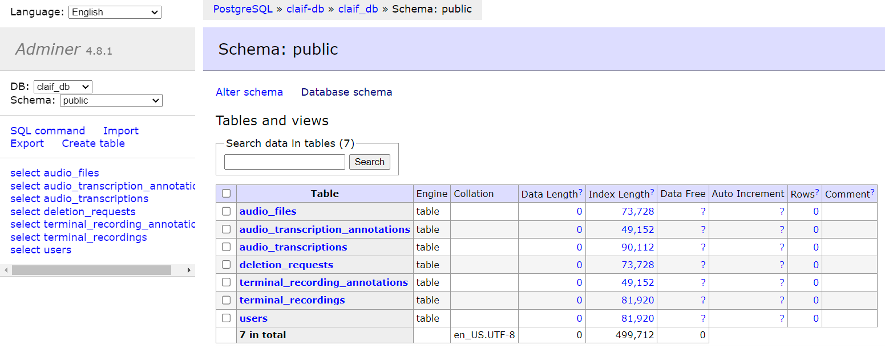

# CopyLeft AI Foundation API
The CLAIF-API and [CLAIF Annotator](https://github.com/arthurwolf/annotator) are part of the CopyLeft AI Foundation (CLAIF) project, which aims to create and share ethically-sourced AI and ensure a future where AI is free as in freedom.

Learn more at [claif.org](https://claif.org).

The services include:
- API Gateway (Traefik Reverse Proxy)
- CLAIF API (FastAPI with Swagger and Redoc Docs)
- CLAIF API Database (Postgres)
- Adminer (Database Administration Utility)
- Keycloak (Identity and Access Management)
- Keycloak Database (Postgres)

# Installation
## Using Docker and Docker-Compose

### Prerequisites
- Docker (https://docs.docker.com/engine/install/)

### docker and docker-compose commands
- build the images and start the containers with `docker-compose up -d`
  - if you've modified any of the Dockerfile (image) layers (e.g. modifying src/claif-api/main.py), you'll want to rebuild the images with `docker-compose up -d --build`
- tear them down with `docker-compose down`
  - `docker-compose down -v` will also remove the volumes
- stop them with `docker-compose stop`
- start them with `docker-compose start`
- view the logs with `docker-compose logs -f`
- view the logs for a specific service with `docker-compose logs -f <service_name>`
- list the running containers with `docker ps`

*NOTE - if you change a Dockerfile, you'll want to run:* `docker-compose up -d --build` *to rebuild the images*.
## Using Kubernetes
Coming Soon

# Using the API
## CLI Tool

### Installation
To install the CLI tool, follow these steps:

1. **Navigate to the CLI Directory**
   - Go to the `src/claif-api/claif_cli` directory.

2. **Install Dependencies**
   - Install the necessary dependencies using Poetry:
     ```bash
     poetry install
     ```

3. **Run the CLI Tool**
   - Execute the CLI tool with:
      ```bash
      PYTHONPATH=./ poetry run python main.py --base-url=http://localhost:8000/v1 login
      
      Username: testuser
      Password: 
      Login successful! Access token saved.
      ```
   - The CLI tool is now ready to use. The access token is saved in a file named `access_token.txt` in the current directory.
     - After 30 minutes it will expire and then it will ask you for your username and password again.

### Usage
The CLAIF-CLI provides several commands to interact with the API. Below is a list of available commands and their usage:

#### Available Commands

- **Login**: Authenticate with the FastAPI app.
  ```bash
  python main.py login
  ```

- **Review a Recording**: Review an existing recording by its ID.
  ```bash
  python main.py review-recording <recording_id> [--revision-number <number>]
  ```
  - `<recording_id>`: The ID of the recording to review.
  - `--revision-number`: Optional. Specify the revision number of the recording.

- **Create a New Recording**: Create a new terminal or audio recording.
  ```bash
  python main.py create-recording <recording_filepath> <recording_title> <recording_description>
  ```
  - `<recording_filepath>`: Path to the recording file.
  - `<recording_title>`: Title for the new recording.
  - `<recording_description>`: Description of the recording.

- **Update an Existing Recording**: Update details of an existing recording by its ID.
  ```bash
  python main.py update-recording <recording_id> [--recording_filepath <path>] [--title <new_title>] [--description <new_description>]
  ```
  - `<recording_id>`: The ID of the recording to update.
  - `--recording_filepath`: Optional. Path to the updated recording file.
  - `--title`: Optional. New title for the recording.
  - `--description`: Optional. New description for the recording.

- **List All Recordings**: Display a list of all available recordings.
  ```bash
  python main.py list-recordings
  ```

#### Command-Line Options

- `--base-url`: Specify the base URL of the FastAPI application. The default is `http://localhost:8000/v1`.

#### Example Usage

```bash
# Login to the application
python main.py login

# Review a specific recording
python main.py review-recording 123 --revision-number 2

# Create a new recording
python main.py create-recording /path/to/file.asciinema "My Recording" "This is a test recording"

# Update an existing recording
python main.py update-recording 123 --title "Updated Title" --description "New description for the recording"

# List all recordings
python main.py list-recordings

# Ensure you have the correct base URL and authentication details before running the commands.
# example:
python main.py --base-url=https://anno-api.claif.org:8080/v1 login
```

## Testing the API Swagger UI
There is a Swagger UI available at http://localhost:8080/docs that provides a user-friendly interface to browse the API.


### Authentication with Keycloak
Authenticate with:
- username: `testuser`
- password: `testpassword`
- client_id: `fastapi-client`
- client_secret: `(leave this field empty)`


Once authenticated, you can make requests to the API. For example, you can get a user by clicking on the `/users` endpoint and then clicking the "Try it out" button.


### Rate Limiting

Rate limiting has been enabled on the API. You can test this by making multiple requests in quick succession. You will see a 429 response code when the rate limit is exceeded.


FastAPI rate-limits can be defined for individual keycloak users using the `slowapi` library. The request counts are stored in memory, by default. Example:
```python
@app.get("/users/{user_id}", response_model=UserRead)
@limiter.limit("20/minute")  # Limit to 20 requests per minute per user
def read_user(request: Request, user_id: int, db: Session = Depends(get_db)):
    # etc...
```

## Using the API via cURL Requests

Get an access token and make requests to the CLAIF API (token expires in 30 minutes):
```bash
export ACCESS_TOKEN=$(curl -X POST 'http://localhost:8080/v1/auth/token' -H 'Content-Type: application/x-www-form-urlencoded' -d 'username=testuser' -d 'password=testpassword' | jq -r .access_token)

curl -X GET 'http://localhost:8080/v1/users/1' -H "Authorization: Bearer $ACCESS_TOKEN"

# Example result:
{"detail":"User not found"}
```

Inspecting the JWT token
```bash
curl -X POST 'http://localhost:8080/v1/auth/token' -H 'Content-Type: application/x-www-form-urlencoded' -d 'username=testuser' -d 'password=testpassword' | jq -r .access_token | awk -F. '{print $2}' | base64 --decode | jq

# Result:
{
  "exp": 1727390307,
  "iat": 1727390007,
  "jti": "86d3d62c-27f5-47f9-a60c-184e8bc98c4f",
  "iss": "http://keycloak:8080/realms/fastapi",
  "aud": "account",
  "sub": "3ad322d1-b212-42bd-adc0-f7c47252ad2e",
  "typ": "Bearer",
  "azp": "fastapi-client",
  "sid": "9065efa4-45ff-43a7-83e6-914611154493",
  "acr": "1",
  "allowed-origins": [
    "*"
  ],
  "realm_access": {
    "roles": [
      "offline_access",
      "default-roles-fastapi",
      "uma_authorization"
    ]
  },
  "resource_access": {
    "account": {
      "roles": [
        "manage-account",
        "manage-account-links",
        "view-profile"
      ]
    }
  },
  "scope": "openid email profile",
  "email_verified": true,
  "name": "Test User",
  "preferred_username": "testuser",
  "given_name": "Test",
  "family_name": "User",
  "email": "testuser@claif.org"
}
```

# Local Development
## Pre-requisites
- Python 3.8+
- Poetry (https://python-poetry.org/docs/)

## Running the API Locally
To run the API locally, you can use the following steps:
- Navigate to the `src/claif-api` directory
- Install the dependencies with `poetry install`
- Start the FastAPI server with `poetry run uvicorn main:app --host 0.0.0.0 --port 8000 --reload`
```bash
poetry run uvicorn main:app --host 0.0.0.0 --port 8000 --reload
INFO:     Will watch for changes in these directories: ['/home/my-user/projects/claif-api/src/claif-api']
INFO:     Uvicorn running on http://0.0.0.0:8000 (Press CTRL+C to quit)
INFO:     Started reloader process [27639] using WatchFiles
INFO:     Started server process [27643]
INFO:     Waiting for application startup.
INFO:     Application startup complete.
```

Ensure that the rest of the services are running (e.g. Postgres, Keycloak) to test the full functionality of the API.

## Database Operations
See the section on `Adminer` below for a browser-based database administration utility.

The database is truncated and re-seeded with test data on each restart of the `claif-api` service when running with `docker-compose`. See the claif-api service in `docker-compose.yml` to see how this is handled. This is done to ensure that the database is in a consistent state for testing.

### Making Schema Changes
Currently, it is necessary to delete the database and start fresh. This can be done by running `docker-compose down claif-db -v` to remove the volume. Then run `docker-compose up -d --build` to rebuild the images and start the services. In the near future, we will implement [alembic migrations](https://alembic.sqlalchemy.org/en/latest/index.html) to handle schema changes.

### Truncating/resetting and seeding the database without docker-compose:
One can run `./src/claif-api/seed_db.sh` to manually start the FastAPI app, truncate/reset the tables, seed the db with users, and run the integration tests.

But it may be faster to do this by just restarting the `claif-api` service (as mentioned above) with `docker-compose restart claif-api` or `docker-compose up -d --build` if you've made changes since it will automatically truncate and re-seed the database.

## Database Schema:
The database schema for the CLAIF API is defined using SQLAlchemy ORM. The schema consists of the following models (generated by `src/claif-api/models/schema.py`):

### TerminalRecording
```
annotations_count                   INTEGER
content_body                        VARCHAR
content_metadata                    VARCHAR
created_at                          DATETIME
creator_id                          INTEGER
creator_username                    VARCHAR
deleted_at                          DATETIME
description                         VARCHAR
duration_milliseconds               FLOAT
id                                  INTEGER
revision_number                     INTEGER
size_bytes                          INTEGER
title                               VARCHAR
Relationships:
- creator (related to User)
- annotations (related to TerminalRecordingAnnotation)
- annotation_reviews (related to TerminalAnnotationReview)
```


### TerminalRecordingAnnotation
```
annotation_text                     VARCHAR
creator_id                          INTEGER
end_time_milliseconds               FLOAT
id                                  INTEGER
level                               INTEGER
recording_id                        INTEGER
reviews_count                       INTEGER
revision_number                     INTEGER
start_time_milliseconds             FLOAT
Relationships:
- creator (related to User)
- recording (related to TerminalRecording)
- annotation_review (related to TerminalAnnotationReview)
```


### AudioTranscription
```
annotations_count                   INTEGER
audio_file_id                       INTEGER
content_body                        VARCHAR
content_metadata                    VARCHAR
created_at                          DATETIME
creator_id                          INTEGER
creator_username                    VARCHAR
deleted_at                          DATETIME
description                         VARCHAR
duration_milliseconds               FLOAT
id                                  INTEGER
revision_number                     INTEGER
size_bytes                          INTEGER
title                               VARCHAR
Relationships:
- creator (related to User)
- audio_file (related to AudioFile)
- annotations (related to AudioTranscriptionAnnotation)
- annotation_reviews (related to AudioAnnotationReview)
```


### AudioTranscriptionAnnotation
```
annotation_text                     VARCHAR
creator_id                          INTEGER
end_time_milliseconds               FLOAT
id                                  INTEGER
level                               INTEGER
recording_id                        INTEGER
reviews_count                       INTEGER
revision_number                     INTEGER
start_time_milliseconds             FLOAT
Relationships:
- creator (related to User)
- recording (related to AudioTranscription)
- annotation_review (related to AudioAnnotationReview)
```


### TerminalAnnotationReview
```
annotation_id                       INTEGER
created_at                          DATETIME
creator_id                          INTEGER
creator_username                    VARCHAR
id                                  INTEGER
q_can_anno_be_halved                BOOLEAN
q_can_you_improve_anno              BOOLEAN
q_can_you_provide_markdown          BOOLEAN
q_does_anno_match_content           BOOLEAN
q_how_well_anno_matches_content     INTEGER
recording_id                        INTEGER
revision_number                     INTEGER
Relationships:
- creator (related to User)
- annotation (related to TerminalRecordingAnnotation)
- recording (related to TerminalRecording)
```


### AudioAnnotationReview
```
annotation_id                       INTEGER
created_at                          DATETIME
creator_id                          INTEGER
creator_username                    VARCHAR
id                                  INTEGER
q_can_anno_be_halved                BOOLEAN
q_can_you_improve_anno              BOOLEAN
q_can_you_provide_markdown          BOOLEAN
q_does_anno_match_content           BOOLEAN
q_how_well_anno_matches_content     INTEGER
recording_id                        INTEGER
revision_number                     INTEGER
Relationships:
- creator (related to User)
- annotation (related to AudioTranscriptionAnnotation)
- recording (related to AudioTranscription)
```


### AudioFile
```
created_at                          DATETIME
creator_id                          INTEGER
creator_username                    VARCHAR
deleted_at                          DATETIME
description                         VARCHAR
duration_milliseconds               FLOAT
file_url                            VARCHAR
id                                  INTEGER
revision_number                     INTEGER
size_bytes                          INTEGER
title                               VARCHAR
Relationships:
- creator (related to User)
- audio_transcription (related to AudioTranscription)
```


### User
```
created_at                          DATETIME
creator_id                          INTEGER
creator_username                    VARCHAR
id                                  INTEGER
keycloak_id                         VARCHAR
username                            VARCHAR
Relationships:
- creator (related to User)
- audio_files (related to AudioFile)
- audio_transcriptions (related to AudioTranscription)
- audio_annotations (related to AudioTranscriptionAnnotation)
- audio_annotation_reviews (related to AudioAnnotationReview)
- terminal_recordings (related to TerminalRecording)
- terminal_annotations (related to TerminalRecordingAnnotation)
- terminal_annotation_reviews (related to TerminalAnnotationReview)
```

# General Information About the Services
## CLAIF API
The CLAIF API is built using FastAPI, a modern web framework for building APIs with Python. FastAPI is designed to be fast, easy to use, and highly performant, making it an excellent choice for building APIs that require high throughput and low latency.

### Overview of FastAPI:
- FastAPI is built on top of Starlette, a high-performance ASGI framework, and Pydantic, a data validation library. It is designed to be fast and efficient, making it suitable for high-performance applications.
- FastAPI provides automatic data validation and serialization using Pydantic models. It automatically converts request data to Python objects and validates the data against the defined schema.
- FastAPI supports asynchronous programming using Python's async/await syntax. It allows you to write asynchronous code that can handle multiple requests concurrently, improving performance and scalability.
- FastAPI generates interactive API documentation using Swagger UI and ReDoc. It automatically generates API documentation based on the defined endpoints, request/response models, and docstrings, making it easy to understand and test the API.

### Pydantic Models:
Pydantic models are used to define the request and response data structures in FastAPI. They provide automatic data validation, serialization, and documentation generation for API endpoints. Pydantic models are defined as Python classes that inherit from the `BaseModel` class and define the fields and their types.

#### Example Pydantic model:
```python
from pydantic import BaseModel

class UserDetailsRequest(BaseModel):
    user_id: int

class UserDetailsResponse(BaseModel):
    user_id: int
    username: str
    email: str
```

### SQLAlchemy ORM:
FastAPI integrates with SQLAlchemy, a popular Object-Relational Mapping (ORM) library for Python, to interact with databases. SQLAlchemy provides a high-level API for working with databases, allowing you to define models, query data, and perform CRUD operations using Python objects.

#### Example SQLAlchemy model:
```python
from sqlalchemy import Column, Integer, String
from sqlalchemy.ext.declarative import declarative_base

Base = declarative_base()

class User(Base):
    __tablename__ = "users"

    id = Column(Integer, primary_key=True, index=True)
    username = Column(String, unique=True, index=True)
    email = Column(String, unique=True, index=True)
```

#### A note on schema migrations:
Migration scripts can be generated using Alembic, a database migration tool for SQLAlchemy. Alembic allows you to manage database schema changes, create new migrations, and apply migrations to update the database schema.

### Pydantic and SQLAlchemy Integration:
FastAPI provides integration between Pydantic models and SQLAlchemy models, allowing you to define Pydantic models that mirror the database schema. This integration simplifies data validation, serialization, and database operations by automatically converting between Pydantic models and SQLAlchemy models.

#### Example Pydantic-SQLAlchemy integration:
```python
from pydantic_sqlalchemy import sqlalchemy_to_pydantic
from sqlalchemy.orm import Session

from models import User
from schemas import UserCreate, UserRead

UserCreate = sqlalchemy_to_pydantic(User, exclude=["id"])
UserRead = sqlalchemy_to_pydantic(User)
```

#### How FastAPI makes use of this integration:
- When creating a new user, the API expects a `UserCreate` Pydantic model in the request body. This model is validated against the schema and converted to a SQLAlchemy `User` model for insertion into the database.
- When retrieving a user, the API returns a `UserRead` Pydantic model that mirrors the database schema. The SQLAlchemy `User` model is converted to a `UserRead` model before being returned to the client.

#### Example FastAPI endpoints using Pydantic-SQLAlchemy integration:
```python
@app.post("/users/", response_model=UserRead)
def create_user(user: UserCreate, db: Session = Depends(get_db)):
    db_user = User(username=user.username, email=user.email)
    db.add(db_user)
    db.commit()
    db.refresh(db_user)
    return db_user

@app.get("/users/{user_id}", response_model=UserRead)
def read_user(user_id: int, db: Session = Depends(get_db)):
    db_user = db.query(User).filter(User.id == user_id).first()
    if db_user is None:
        raise HTTPException(status_code=404, detail="User not found")
    return db_user
```

## API Gateway (Traefik)
Traefik is an open-source, modern reverse proxy and load balancer designed to handle dynamic microservices environments. It integrates with various orchestration and container platforms like Docker, Kubernetes, Mesos, and Consul to automatically route and manage traffic for web applications.

- visit the dashboard at http://localhost:8081
- make requests to the CLAIF API at http://localhost:8080


Key Features of Traefik:
- Reverse Proxy:
  - Traefik acts as a reverse proxy, forwarding client requests to one or more backend servers, typically used to serve web applications.
- Dynamic Configuration:
  - Traefik dynamically discovers and configures services from container orchestrators like Docker, Kubernetes, or cloud platforms without requiring manual configuration of routes. It automatically adjusts when new services are added or removed.
- Load Balancing:
  - Traefik can distribute incoming traffic across multiple backend services, providing load balancing to improve availability and performance.
- Auto SSL with Let's Encrypt:
  - Traefik can automatically generate and manage SSL certificates using Let's Encrypt, making it easy to enable HTTPS for your services.
- Path-Based and Host-Based Routing:
  - Traefik supports both path-based routing (e.g., /api) and host-based routing (e.g., api.example.com), allowing you to route traffic to different backend services based on the URL or domain name.
- Middleware:
  - Traefik has built-in support for middleware that allows you to modify or enhance requests and responses. For example, you can use rate-limiting, retry mechanisms, authentication, or headers modification.
- Health Checks:
  - Traefik can monitor the health of backend services and route traffic only to healthy instances, improving reliability and fault tolerance.
- Dashboard:
  - Traefik includes a real-time dashboard that provides visibility into active services, routing rules, and load balancer statistics.
- HTTP/2 and gRPC Support:
  - It supports modern protocols like HTTP/2 and gRPC, enabling improved performance and efficiency for certain types of web applications.
- Extensive Provider Support:
  - Traefik works with multiple backends like Docker, Kubernetes, Amazon ECS, Consul, Rancher, and more. It can automatically detect changes in the infrastructure and reconfigure itself.
- Authentication and Authorization:
  - Traefik supports authentication middlewares (like basic auth, OAuth2, etc.) to secure routes.

## CLAIF API (FastAPI)
### Swagger Docs (Swagger UI)
- visit http://localhost:8082/docs


## Adminer
A lightweight browser-based database administration utility. This has been added only as a convenience to expedite onboarding.
- visit http://localhost:8083




## Keycloak
Keycloak is an identity and access management (IAM) solution. It provides authentication and authorization services for applications, enabling features like Single Sign-On (SSO), user federation, and identity brokering.
- visit the admin console at http://localhost:8085


Key Features of Keycloak:
- Single Sign-On (SSO):
  - Keycloak allows users to log in once and gain access to multiple applications without needing to log in again for each app.
- Identity Brokering and Social Login:
  - Keycloak can act as an intermediary between users and external identity providers (e.g., Google, Facebook, GitHub) to enable social logins.
- User Federation:
  - You can integrate Keycloak with existing user directories such as LDAP or Active Directory, allowing you to manage users from a central system.
- Centralized User Management:
  - Keycloak provides a central place to manage users, roles, and permissions. Users can be created, modified, and deleted through the admin console.
- Role-Based Access Control (RBAC):
  - Keycloak supports role-based access control, allowing administrators to define roles and permissions for users and groups within applications.
- OAuth 2.0, OpenID Connect, and SAML:
  - It supports industry-standard protocols like OAuth 2.0, OpenID Connect, and SAML for secure authentication and authorization.
- Multi-Factor Authentication (MFA):
  - Keycloak allows the implementation of multi-factor authentication to add additional security to user logins.
- Social Login and Identity Providers:
  - Users can log in using existing credentials from social identity providers (Google, Facebook, etc.) or enterprise identity providers.
- Admin Console and User Account Management:
  - Keycloak provides an easy-to-use admin console for managing users, roles, and permissions. It also offers a self-service account management console for users to update their profile, change passwords, and more.
- Support for Custom Authentication Flows:
  - You can define custom authentication flows and integrate external identity providers to meet specific authentication needs.
